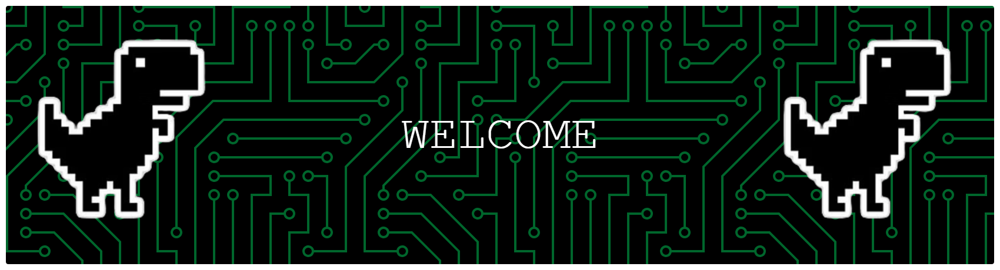

  

   
  <samp>
    Hello there! I'm <b><a rel="nofollow noopener noreferrer" target="_blank" href="https://tanx.dev">Eunice E. Moradillo</a></b>.
     I'm a Computer Engineering student from Technological Institute of the Philippines. 
</samp>

terminal.gif

 <b><h2 style="color: #fc6203">H E L L O &nbsp; , W E L C O M E !</h2> </b>

# 💫 About Me:
Hi! I am Eunice E. Moradillo, a Computer Engineering student at Technological Institute of the Philippines. who loves building projects, learning new technologies, and solving real-world problems. I am currently studying with C++ and  Python. Welcome to my GitHub and feel free to explore my work!

<h3 id="-quick-facts">✨ Quick Facts</h3>
<ul>
<li>👨🏽‍💻 A Computer Engineering Student.</li>
<li>🌱 I’m currently learning C++ and Python.</li>
</ul>
<!--- ⚡️ Fun-Fact: I sleep at 12am to wake up at 3am 🙃. -->
<ul>
<li>🎿 Hobbies other than coding : Playing online games, eating, reading and art stuff.</li>
</ul>

